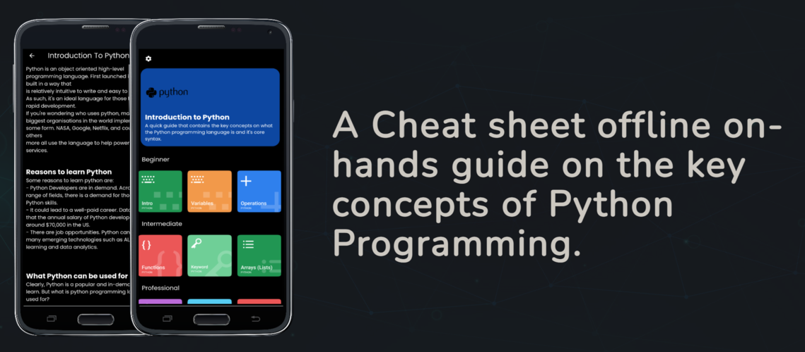
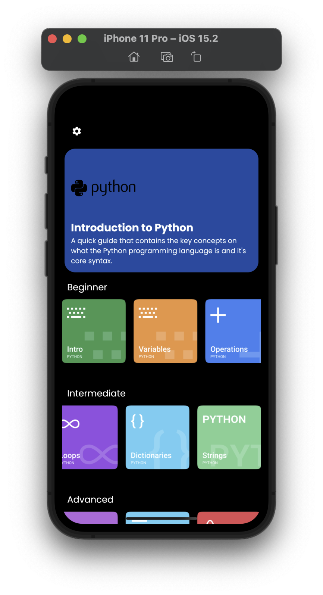
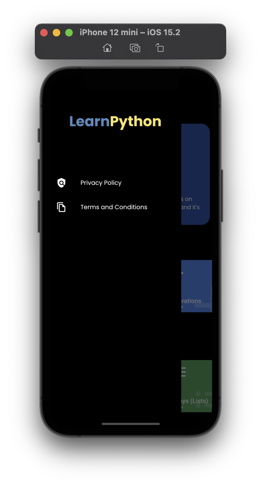
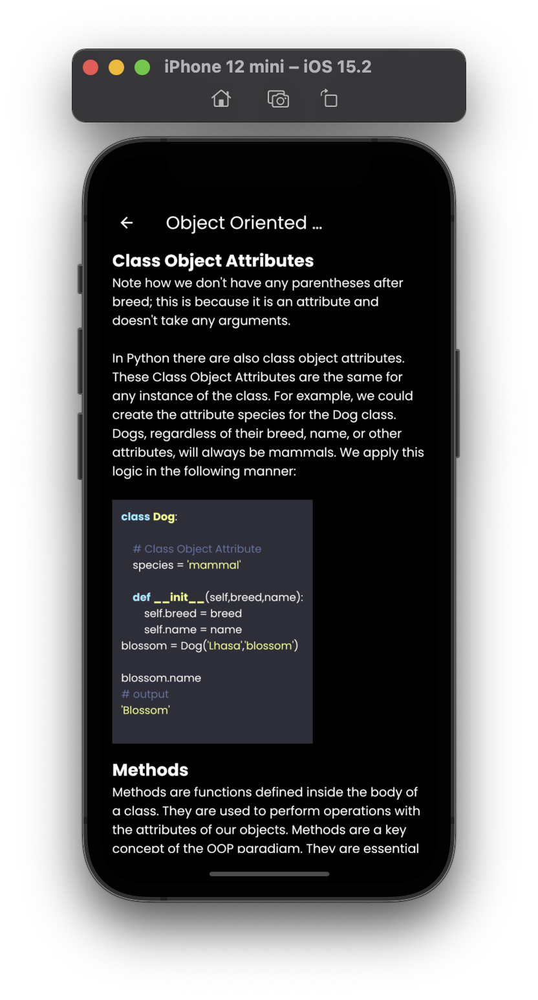
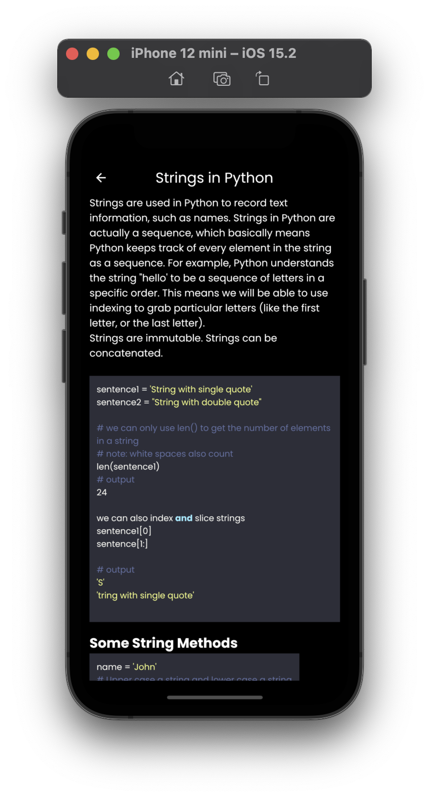

# Learn Python: Key Concepts Guide

learn Python key concepts guide is an mobile offline application  that contains hands on guide in getting started in learning the Python 3 programming language. Learn Python: Key Concepts Guide was built using the Dart Flutter framework. Please feel free to use and contrutions are open.

## Getting Started

## Screenshots

 

| Home Screen | Drawer Screen | 
|    :---:     |     :---:      |  
|    |    |

| Object Oriented Screen | Strings Screen | 
|    :---:     |     :---:      |  
|    |    |

## Contributions

Feel free to contribute to this project.

If you find a bug or want a feature, but don't know how to fix/implement it, please fill an [issue](https://github.com/levi956/new-learn-python/issues).
If you fixed a bug or implemented a feature, please send a [pull request](https://github.com/levi956/new-learn-python/pulls).
